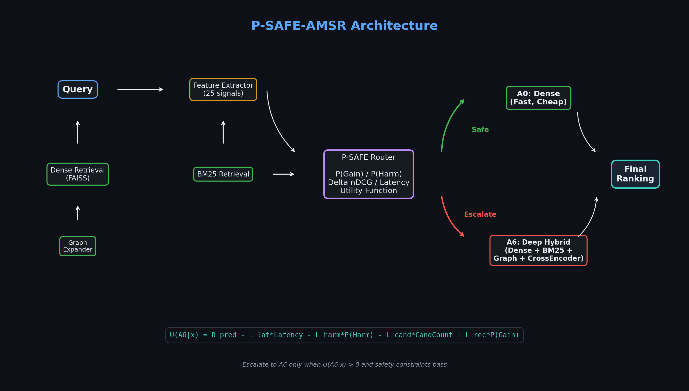
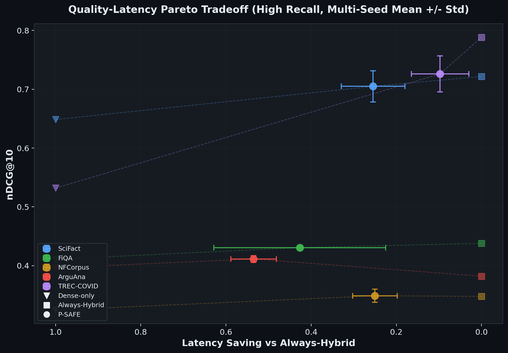
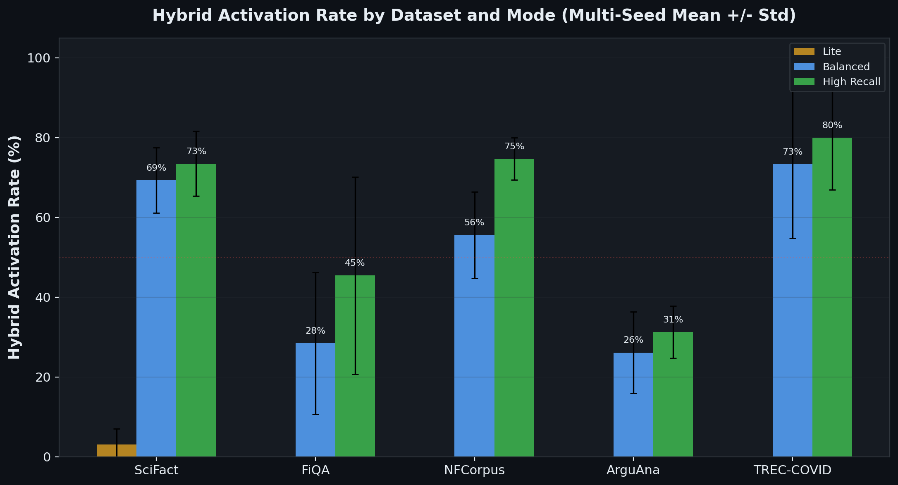
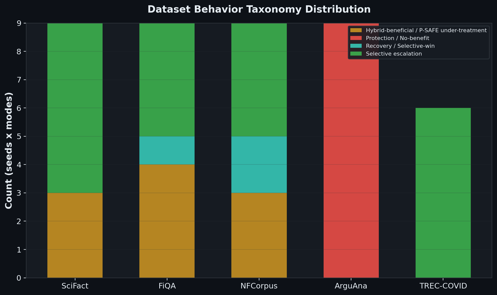
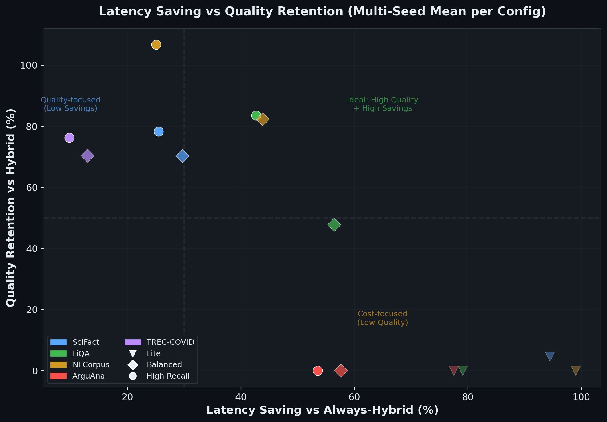
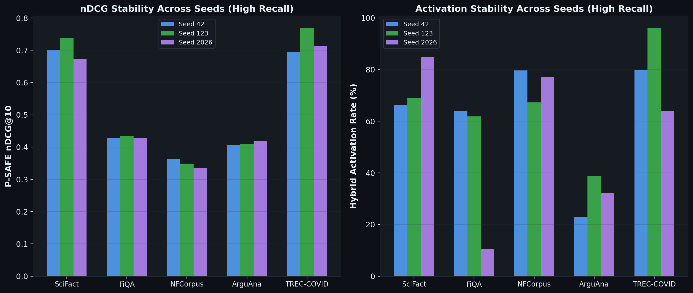

<p align="center">
  <strong>🔬 Research Prototype</strong> &nbsp;|&nbsp;
   &nbsp;
   &nbsp;
   &nbsp;
  
</p>

# P-SAFE-AMSR: Safety-Aware Adaptive Retrieval for Reliable AI Agents

**Probabilistic routing for deciding when RAG systems should use cheap Dense retrieval versus expensive Hybrid/CrossEncoder reranking.**

---

## Executive Summary

P-SAFE-AMSR is a research prototype for safer and more compute-efficient retrieval in AI agent and retrieval-augmented generation (RAG) systems. Many deployed systems default to expensive retrieval and reranking pipelines for every query, regardless of difficulty. This approach wastes compute, increases latency, and can sometimes degrade result quality on queries that were already well-served by simpler methods. P-SAFE reframes retrieval escalation as a **per-query decision problem**: for each incoming query, the router estimates the expected gain, the risk of harm, the predicted quality change, and the latency cost before choosing between Dense retrieval and Deep Hybrid retrieval. The current public version (P-SAFE v1) focuses on the stable **Dense-vs-Deep-Hybrid binary routing** setting. The broader A0–A16 action-space design, which includes intermediate pipeline configurations, is preserved as experimental future work and is not presented as validated.

---

## Why This Matters

As AI agents grow more capable and autonomous, they increasingly rely on retrieval systems to determine what information they see before making decisions or taking actions. Retrieval is no longer just a search problem — it is becoming part of an AI system's **decision layer**.

This creates a fundamental tension:

- **If retrieval always escalates** to expensive CrossEncoder rerankers, systems become slower, more compute-intensive, and harder to deploy outside elite GPU environments.
- **If retrieval stays too cheap**, systems risk missing critical evidence, leading to incomplete or incorrect downstream decisions.
- **If aggressive reranking harms an easy query**, the final answer can degrade — a failure mode that is rarely measured or discussed.

P-SAFE asks a simple but important question:

> *"When should an AI retrieval system spend more compute, and when should it stay simple?"*

This question connects to several themes in responsible AI development:

- **Reliable AI agents** — retrieval quality directly affects what evidence an agent uses before acting.
- **Secure AI infrastructure** — unnecessary compute creates attack surface and resource waste.
- **Compute-efficient AI** — adaptive routing reduces total compute without uniformly degrading quality.
- **Interpretable decision layers** — the router's probability estimates (P_gain, P_harm, utility) are inspectable per query.
- **Resource-constrained environments** — adaptive routing makes advanced retrieval more accessible to researchers and organizations without large GPU budgets.
- **Broader access to advanced AI** — by avoiding unnecessary expensive operations, P-SAFE enables stronger retrieval in settings where always-on Hybrid is infeasible.

---

## Core Idea: P-SAFE Is a Router, Not a Retriever

P-SAFE does not replace Dense retrieval or CrossEncoder reranking. It sits **above** them as a decision controller that chooses which pipeline to activate for each query.

### Per-Query Decision Signals

For each incoming query, the router estimates:

| Signal | Description |
|--------|-------------|
| **P(Gain)** | Probability that Hybrid retrieval improves ranking quality over Dense |
| **P(Harm)** | Probability that Hybrid retrieval degrades quality compared to Dense |
| **Predicted Δ nDCG** | Expected change in ranking quality (positive = improvement) |
| **Predicted Latency** | Expected additional compute time for the Hybrid pipeline |
| **Candidate Count** | Number of documents sent to expensive reranking stages |

### Routing Decision

Based on these signals, P-SAFE selects one of two actions:

- **A0 — Dense retrieval**: fast, cheap, sufficient for easy queries.
- **A6 — Deep Hybrid / CrossEncoder reranking**: expensive, powerful, useful when Dense retrieval leaves quality on the table.

### Utility Function

The routing decision is governed by a safety-constrained utility function:

```
U(A6 | x) = predicted_Δ
           − λ_latency   × predicted_latency
           − λ_harm      × P(Harm)
           − λ_candidate  × candidate_count
           + λ_recovery   × P(Gain)
```

**In plain language:** Hybrid retrieval is selected only when its expected quality benefit outweighs the combined cost of extra latency, risk of harming the result, and additional candidate processing. When this tradeoff is unfavorable, P-SAFE falls back to Dense retrieval.

The λ parameters control the operating point. Three pre-configured modes are provided:

| Mode | Behavior |
|------|----------|
| **Lite** | Conservative — strongly penalizes latency and harm; prefers Dense |
| **Balanced** | Moderate — balances quality gain against cost and risk |
| **High Recall** | Aggressive — prioritizes quality recovery; more willing to escalate |

---

## What "Safety-Aware" Means in This Context

In this repository, **"safety-aware" refers to harm-aware retrieval routing** — not physical safety or adversarial robustness in the security sense.

The system explicitly models the possibility that a more powerful retrieval pipeline can sometimes **reduce** retrieval quality or waste compute. This happens more often than typically acknowledged: CrossEncoder rerankers can confidently reorder results in ways that hurt easy queries where Dense retrieval was already sufficient.

P-SAFE tries to avoid:

- **Over-treating easy queries** — applying expensive reranking to queries already well-answered by Dense.
- **Unnecessary CrossEncoder calls** — each reranking pass has real latency and compute cost.
- **Retrieval degradation from aggressive reranking** — when the reranker introduces noise or domain mismatch.
- **Blindly using the most expensive pipeline** for every query regardless of difficulty.
- **Unstable quality-latency behavior** — inconsistent performance depending on query difficulty.

---

## Current Public Scope (P-SAFE v1)

This repository presents **P-SAFE v1**, the stable and reproducible version of the system.

**P-SAFE v1 evaluates the binary routing setting:**

| Action | Pipeline | Cost |
|--------|----------|------|
| **A0** | Dense retrieval (dual-encoder) | Low |
| **A6** | Deep Hybrid (Dense + BM25 + Graph + CrossEncoder) | High |

The broader A0–A16 action-space design — which includes intermediate pipeline configurations such as Dense+BM25, Dense+BM25+CE at varying depths, and BGE-M3 variants — is part of the long-term research direction. The code for A0–A16 is preserved in `archive/experimental_a0_a16/`, but the current public results focus on the cleaner and more reproducible Dense-vs-Deep-Hybrid setting.

---

## Seed and Multi-Seed Evaluation

### What Is a Seed?

A **seed** is a fixed random number used to make stochastic processes reproducible. In this project, seeds control how queries are assigned to **train**, **validation**, and **test** splits.

```
Seed 42   → Split A  (e.g., query Q7 in train, Q12 in test)
Seed 123  → Split B  (e.g., query Q7 in test, Q12 in train)
Seed 2026 → Split C  (e.g., query Q7 in val,  Q12 in train)
```

The dataset, retrieval models, router architecture, baselines, and metrics stay identical. Only the assignment of queries into train/validation/test changes.

### Why Multi-Seed?

Multi-seed evaluation means running the same experiment across **multiple independent random splits**. This helps determine whether P-SAFE's routing behavior is consistent or whether it only performs well on one lucky partition.

> We use multi-seed evaluation to reduce dependence on a single train/validation/test split and to make the reported behavior more reproducible.

If performance is stable across seeds, the routing method is more trustworthy. If performance varies heavily across seeds, that reveals useful limitations about the method's robustness.

The repository includes validated results across seeds **42**, **123**, and **2026** for each dataset and mode combination.

---

## Experimental Pipeline

Each experiment follows a strict sequence:

```
1.  Load BEIR benchmark dataset
2.  Build Dense retrieval baseline (FAISS inner-product index)
3.  Build BM25 lexical index
4.  Build k-NN graph for expansion candidates
5.  Construct Deep Hybrid pipeline (Dense + BM25 + Graph + CrossEncoder)
6.  Extract per-query routing features (25 features)
7.  Compute per-query nDCG@10 for both Dense and Deep Hybrid
8.  Create leakage-safe stratified train/val/test split
9.  Train P-SAFE router on training queries only
10. Tune routing thresholds on validation queries only
11. Evaluate once on held-out test queries
12. Run all baselines on the same test queries
13. Compute extended metrics, statistical significance tests, and latency breakdown
14. Save reproducibility artifacts
```

### Leakage-Safe Splitting

Training, validation, and test queries are **strictly separated**. The router is trained on training queries, thresholds are tuned on validation queries, and final evaluation happens on held-out test queries. No test query information influences the routing model.

---

## Baselines

P-SAFE is compared against **8 baseline routing strategies**:

| Baseline | Strategy |
|----------|----------|
| **Dense-only** | Always use Dense retrieval |
| **Always-Hybrid** | Always use Deep Hybrid — the expensive ceiling |
| **Random** | Choose Dense or Hybrid with probability tuned on validation |
| **Dense-margin** | Escalate when the gap between top Dense scores is small |
| **Dense-entropy** | Escalate when Dense score distribution has high entropy |
| **Regression-only** | Train a regressor to predict Δ nDCG; escalate when predicted delta exceeds a threshold |
| **Classification-only** | Train a classifier to predict gain probability; escalate when P(gain) exceeds a threshold |
| **Oracle** | Cheating baseline — always picks whichever pipeline has higher true nDCG for each query |

### Honest Baseline Interpretation

The goal of this comparison is **not** simply to beat every baseline in raw nDCG. The goal is to study when adaptive routing provides a useful quality-latency-safety tradeoff.

In some dataset/mode configurations, simple routers or Always-Hybrid may achieve higher raw nDCG. P-SAFE should be interpreted as a **safety-aware routing framework** that explicitly models harm risk and latency cost, not as a universal accuracy winner.

---

## Metrics

Each experiment reports a comprehensive set of metrics. Here is what each one measures:

| Metric | What It Measures |
|--------|-----------------|
| **nDCG@10** | Normalized Discounted Cumulative Gain — standard ranking quality metric |
| **Recall@10** | Fraction of relevant documents appearing in the top 10 results |
| **Latency** | Wall-clock time for retrieval, measured per query |
| **Hybrid Activation Rate** | Percentage of test queries where P-SAFE chose Deep Hybrid over Dense |
| **Quality Retention** | How much of Hybrid's quality advantage over Dense the router preserves |
| **Latency Saving** | Latency reduction compared to Always-Hybrid |
| **Recovery Capture** | Among queries where Hybrid helps (hard queries), how much of that improvement P-SAFE captures |
| **Harm Avoidance** | Among queries where Hybrid hurts (easy queries), how much degradation P-SAFE prevents |
| **Oracle Gap Closed** | How close P-SAFE gets to an ideal (cheating) router that always picks the better pipeline |
| **SafeGain** | Net benefit: quality gained on hard queries minus quality lost on easy queries |

---

## Results Summary

The table below reports results from **seed 42** validated runs. Full multi-seed results (seeds 42, 123, 2026) are available in `results/validated/` and should be consulted for a more complete picture. All numbers are drawn directly from `extended_metrics.json` files that passed consistency checks.

| Dataset | Mode | Dense nDCG | Hybrid nDCG | P-SAFE nDCG | Latency Saving | Hybrid Activation | Taxonomy |
|---------|------|-----------|-------------|-------------|----------------|-------------------|----------|
| SciFact | High Recall | 0.647 | 0.733 | 0.702 | 31.6% | 66.4% | Selective escalation |
| FiQA | High Recall | 0.408 | 0.433 | 0.428 | 28.0% | 64.0% | Selective escalation |
| NFCorpus | High Recall | 0.334 | 0.363 | 0.363 | 20.4% | 79.6% | Selective escalation |
| ArguAna | Balanced | 0.395 | 0.392 | 0.407 | 66.1% | 15.0% | Protection / No-benefit |
| TREC-COVID | High Recall | 0.519 | 0.770 | 0.696 | 9.2% | 80.0% | Selective escalation |

**Reading this table:**
- On **SciFact**, P-SAFE achieves 0.702 nDCG while saving 31.6% latency vs Always-Hybrid. It activates Hybrid on 66.4% of queries, avoiding escalation on easier queries.
- On **ArguAna**, Hybrid actually scores *lower* than Dense (0.392 vs 0.395). P-SAFE correctly enters **Protection mode** — activating Hybrid on only 15.0% of queries and saving 66.1% latency while *exceeding* both Dense and Hybrid nDCG.
- On **TREC-COVID**, Hybrid provides a large gain (+0.251 over Dense). P-SAFE captures much of this gain (0.696) but with limited latency savings (9.2%), indicating this is a **Hybrid-dominant** dataset where most queries genuinely benefit from escalation.

> **Important:** These are single-seed results. Performance varies across seeds. P-SAFE does not uniformly outperform all baselines. The value lies in the quality-latency-safety tradeoff, not in raw nDCG dominance.

> **Interpretation:** Across datasets, P-SAFE exhibits different routing behaviors depending on the dataset characteristics: selective escalation when Hybrid helps some queries, protection when Hybrid is not consistently beneficial, and under-treatment when the router is too conservative. These behavioral regimes are informative because they reveal when adaptive retrieval is valuable and when stronger routing mechanisms are needed.

---

## Dataset Behavior Taxonomy

Through systematic evaluation, we observe that datasets and routing modes fall into distinct behavioral regimes:

### 1. Selective Escalation
Hybrid retrieval helps **some** queries but Dense is sufficient for others. P-SAFE correctly identifies and escalates only the queries that benefit, saving compute on the rest.

### 2. Protection / No-Benefit
Hybrid retrieval does not consistently help and may harm some queries. P-SAFE should avoid unnecessary escalation and protect against degradation. Low Hybrid Activation Rate is the correct behavior here.

### 3. Hybrid-Dominant
Most queries benefit substantially from Hybrid retrieval. P-SAFE should behave close to Always-Hybrid, and latency savings are limited. The router adds value mainly through harm avoidance on the few easy queries.

### 4. Under-Treatment
The router is too conservative and misses useful Hybrid gains. This reveals a limitation — the routing model's features or thresholds may need improvement for this dataset.

> This taxonomy is useful because it frames the evaluation not as "did P-SAFE win?" but as "what routing behavior is appropriate for each dataset, and did P-SAFE exhibit it?"

---

## Reproducibility

### Installation

```bash
git clone https://github.com/WasimIqbal0606/-P-SAFE-AMSR-Probabilistic-Safety-Aware-Adaptive-Multi-Source-Retrieval.git
cd -P-SAFE-AMSR-Probabilistic-Safety-Aware-Adaptive-Multi-Source-Retrieval
pip install -r requirements.txt
```

### Smoke Test (Single Dataset, Single Seed, Single Mode)

```bash
python experiments/run_psafe_v1_experiments.py \
  --datasets scifact \
  --seeds 42 \
  --modes high_recall
```

### Full P-SAFE v1 Evaluation

```bash
python experiments/run_psafe_v1_experiments.py \
  --datasets scifact fiqa nfcorpus arguana \
  --seeds 42 123 2026 \
  --modes lite balanced high_recall \
  --use-cache
```

### Output Artifacts

Each run produces the following files in `results/validated/<dataset>/seed_<N>/<mode>/`:

| File | Contents |
|------|----------|
| `reproducibility_manifest.json` | Run configuration, hardware info, and warnings |
| `extended_metrics.json` | Quality Retention, Latency Saving, Harm Avoidance, SafeGain, taxonomy |
| `statistical_tests.json` | Paired t-test, Wilcoxon, Bootstrap CI, Permutation test, Cohen's d |
| `latency_breakdown.json` | Per-component latency (mean, p50, p90, p95, p99) |
| `baseline_results.json` | nDCG for all 8 baselines |
| `baseline_statistical_tests.json` | Significance tests comparing P-SAFE to each baseline |
| `router_class_balance.json` | Training class balance and model diagnostics |
| `router_mode_config.json` | λ parameters and thresholds used |
| `validation_tuning.json` | Threshold search results from validation split |
| `action_predictions.csv` | Per-query routing decisions with probabilities |
| `per_query_metrics.csv` | Per-query nDCG for P-SAFE |
| `safety_metrics.json` | Easy/Hard query breakdown and SafeGain |

---

## Result Consistency Checks

A result is included in public reporting only if **all** of the following match:

- Dataset name and seed
- Router mode and configuration
- Split hash (verifying identical train/val/test partitions)
- Query counts per split
- Extended metrics file is present and parseable
- Statistical tests file is present and parseable
- Latency breakdown file is present
- Baseline results are present for comparison

> Any run that fails consistency checks is treated as invalid for public reporting, even if the numbers look favorable.

Mixed or stale result folders — for example, where metrics were generated with one split but baselines with another — are excluded from claims. This policy exists to maintain research integrity and avoid accidental data leakage or cherry-picking.

---

## Repository Structure

```
├── src/psafe/                        # Core P-SAFE library
│   ├── router.py                     # BPSafeRouter — Bayesian routing logic and utility function
│   ├── feature_extractor.py          # 25-feature extraction from Dense/BM25/Graph signals
│   ├── baselines.py                  # 8 baseline routing strategies
│   ├── evaluation.py                 # Leakage-safe splitting and sensitivity analysis
│   ├── metrics.py                    # Extended safety-aware metrics and taxonomy
│   ├── statistical_tests.py          # Paired t-test, Wilcoxon, Bootstrap, Permutation, Holm-Bonferroni
│   ├── latency_tracker.py            # Per-component latency profiling with context manager
│   ├── actions.py                    # Canonical A0–A16 action definitions
│   ├── hybrid_retriever.py           # Deep Hybrid retrieval pipeline
│   ├── visualization.py              # Result visualization utilities
│   └── experiment_core.py            # Shared experiment infrastructure
│
├── experiments/
│   ├── run_psafe_v1_experiments.py    # Main experiment runner
│   └── configs/                      # YAML configuration files
│
├── results/validated/                # Validated result files (per dataset/seed/mode)
│   ├── scifact/
│   ├── fiqa/
│   ├── nfcorpus/
│   ├── arguana/
│   └── trec-covid/
│
├── tests/                            # Unit and integration tests
│   ├── test_router.py
│   ├── test_feature_extractor.py
│   ├── test_metrics.py
│   ├── test_statistical_tester.py
│   ├── test_consistency.py
│   ├── audit_results.py
│   └── ...
│
├── archive/experimental_a0_a16/      # Experimental full action-space code (future work)
├── docs/                             # Documentation and audit reports
├── paper/                            # Manuscript (LaTeX)
├── figures/                          # Generated figures and plots
├── requirements.txt
├── CITATION.cff
├── LICENSE                           # Apache 2.0
└── README.md
```

---

## Relevance to Broader AI Research

P-SAFE-AMSR addresses a growing concern in AI system design: as AI agents become more widely deployed, retrieval systems will increasingly influence what evidence these systems use before making decisions. This project explores a **safety-aware decision layer** for retrieval escalation — helping AI systems reason about when extra compute is justified and when it may introduce unnecessary cost or harm.

Key connections to responsible AI development:

- **Secure and reliable AI agents** — retrieval quality directly affects downstream decision quality.
- **Interpretable decision layers** — P-SAFE's per-query probability estimates (P_gain, P_harm, expected utility) provide transparency into routing decisions.
- **Compute-efficient AI** — adaptive routing reduces total compute budget without uniform quality degradation.
- **Access beyond elite compute environments** — by avoiding unnecessary expensive operations, P-SAFE enables stronger retrieval for researchers and organizations with limited GPU resources.
- **Early-stage research with integrity** — this is an undergraduate research prototype that prioritizes honest evaluation, comprehensive baselines, and transparent limitations over inflated claims.

---

## Limitations

This section documents known limitations honestly:

- **Binary routing only.** The current public version evaluates Dense (A0) vs Deep Hybrid (A6) routing. The full A0–A16 action space is experimental and not validated.
- **Results vary by dataset and seed.** P-SAFE does not uniformly improve over all baselines on all datasets. Some datasets show clear selective escalation benefits; others do not.
- **Raw nDCG is not always higher.** P-SAFE does not always beat strong simple baselines (e.g., Always-Hybrid, Regression-only) in raw nDCG. Its value lies in the quality-latency-safety tradeoff, not universal accuracy gains.
- **Latency depends on hardware.** Reported latency values depend on the specific GPU, CPU, and software versions used. They should be interpreted comparatively (within the same run), not as absolute benchmarks.
- **Small-scale datasets.** Current experiments use BEIR benchmark datasets (SciFact, FiQA, NFCorpus, ArguAna, TREC-COVID), which are relatively small. Larger-scale evaluations are needed.
- **Research prototype, not production-ready.** This system is designed for research experimentation and does not include production features like online serving, model versioning, or fault tolerance.
- **Feature engineering is manual.** The 25 routing features are hand-designed. Learned feature representations may improve routing accuracy.

---

## Future Work

- **Full A0–A16 action-space routing** — evaluating intermediate pipeline configurations for finer-grained cost-quality control.
- **Better low-cost first-stage router** — reducing the overhead of feature extraction and routing decisions.
- **Stronger multi-seed and multi-dataset evaluation** — expanding to more BEIR datasets and additional seed configurations.
- **Production RAG integration** — integrating P-SAFE routing into real-world RAG pipelines.
- **Online adaptation to query drift** — adapting routing thresholds as query distributions change over time.
- **Neuromorphic and plasticity-inspired routing** — exploring biologically-inspired adaptive mechanisms for routing decisions.
- **Deployment on low-resource hardware** — optimizing the routing pipeline for CPU-only or edge environments.
- **Stronger interpretability of routing decisions** — providing explanations for why specific queries were escalated or not.
- **Uncertainty-calibrated routing** — replacing the current LCB placeholder with bootstrap or conformal uncertainty estimates.

---

## Visuals

### Architecture



### Quality–Latency Pareto Tradeoff



### Hybrid Activation Rate by Dataset and Mode



### Dataset Behavior Taxonomy Distribution



### Latency Saving vs Quality Retention



### Multi-Seed Stability



---

## Citation

```bibtex
@misc{iqbal2026psafeamsr,
  title   = {P-SAFE-AMSR: Probabilistic Safety-Aware Adaptive Multi-Source Retrieval},
  author  = {Iqbal, Wasim},
  year    = {2026}
}
```

---

## License

Apache License 2.0. See [LICENSE](LICENSE) for full text.
